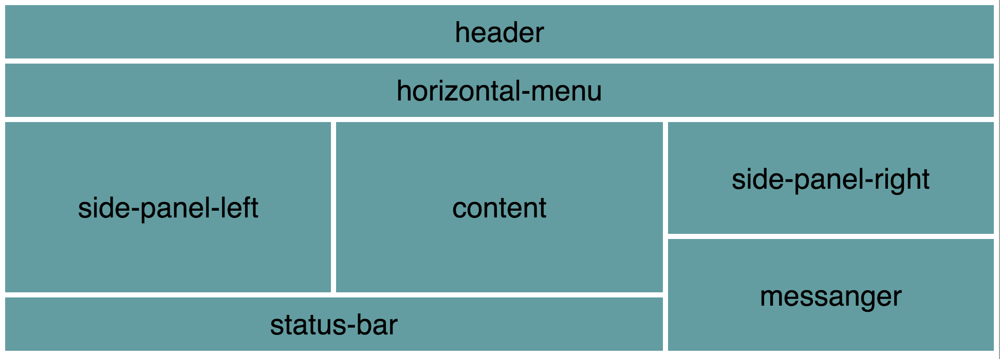

## nextbuild-2017-css-grid

This project describes a journey from ugly, old-fashined, css-based styling to fresh, modern and exciting way of building the styling with javascript - as demonstrated during live coding session at [NextBuild 2017](http://nextbuild.nl). You may disagree...that's ok with me.

Anyway, this demo project encourages the experimentation with expressing css in javascript. CSS in Javascript allows for more declariative DSLs and can leverage the codding conventions.

An example here is very immature (I have put it all together in a couple of hours as demo) implementation of a `Grid` class, which should take away lots of boilerplate code, making creating the grid-based layout of a page much easier and cleaner. A demo is in React - my favorite environment.

So, how could it work.

So, you build a grid-based layout, and you want your grid to look like this:



It is maybe a bit overcomplicated, but not impossible for in many cases, but it already requires lots of markup. A ready to use markup may look like this:

```javascript
<div class="container">
  <section class="header">header</section>
  <section class="horizontal-menu">horizontal-menu</section>
  <section class="side-panel-left">side-panel-left</section>
  <section class="content">content</section>
  <section class="side-panel-right">side-panel-right</section>
  <section class="messanger">messanger</section>
  <section class="status-bar">status-bar</section>
</div>
```

and the associated styling may look like that:

```css
.container {
  display: grid;
  grid-gap: 5px;
  grid-template-areas:
    "header header header"
    "horizontal-menu horizontal-menu horizontal-menu"
    "side-panel-left content side-panel-right"
    "side-panel-left content side-panel-right"
    "side-panel-left content messanger"
    "status-bar status-bar messanger";
  grid-template-columns: 1fr 1fr 1fr;
  grid-template-rows: 1fr 1fr 1fr 1fr 1fr 1fr 1fr;
}

section {
  display: flex;
  justify-content: center;
  align-items: center;
  font-size: 20px;
  background-color: CadetBlue;
}

.header {
  grid-area: header;
}

.horizontal-menu {
  grid-area: horizontal-menu;
}

.side-panel-left {
  grid-area: side-panel-left;
}

.content {
  grid-area: content;
}

.side-panel-right {
  grid-area: side-panel-right;
}

.messanger {
  grid-area: messanger;
}

.status-bar {
  grid-area: status-bar;
}
```
I think it is already quite readbale comparing to waht you would have to do with e.g. flex, but I still feel it is also quite verbose and in the end error-prone.

The key to understanding the actual layout (without looking at the end result of course), is to look at the `grid-template-areas` CSS property:

```css
grid-template-areas:
    "header header header"
    "horizontal-menu horizontal-menu horizontal-menu"
    "side-panel-left content side-panel-right"
    "side-panel-left content side-panel-right"
    "side-panel-left content messanger"
    "status-bar status-bar messanger";
```

This, again is not very bad, but in my opinion already presents unnecessary coupling between the purpose of the element (e.g. header) and its position on the grid. Moreover, I find this notation quite verbose, a bit cluttered, and in the end also error-prone. A first step towards even more declarative description of the grid may look as follows:

```css
grid-template-areas:
    "a a a"
    "b b b"
    "c d e"
    "c d e"
    "c d f"
    "g g f";
```

Here, we use sequential alphabet letters - the description becomes shorter, and in my opinion also a bit easier to understand and less error-prone. Of course, we need to bind the grid to the actual content:

```css
.header {
  grid-area: a;
}

.horizontal-menu {
  grid-area: b;
}

.side-panel-left {
  grid-area: c;
}

.content {
  grid-area: d;
}

.side-panel-right {
  grid-area: e;
}

.messanger {
  grid-area: f;
}

.status-bar {
  grid-area: g;
}
```

In some way, I find this way more declarative: a *header* element goes to grid area *a*, *horizontal-menu* goes to grid area *b*, *side-panel-left* goes to grid area *c*, etc. It is still quite verbose though, and by using javascript we can make the whole thing even more declarative and concise.

Taken all what I said above, a very minimalistic (but sufficient as a starting point) DSL for  defining a grid-layout might look like this:

```javascript
let grid = new Grid([
  'a a a',
  'b b b',
  'c d e', 
  'c d e', 
  'c d f', 
  'g g f'
], [
  'header',
  'horizontalMenu',
  'sidePanelLeft',
  'content',
  'sidePanelRight',
  'messanger',
  'statusBar'
]);

const gridStyles = grid.applyToStyles({});
```

The `applyToStyles` method takes styles object as an argument and it will extend it with a style for the `container` grid element and it will also correctly assign the grid areas.

But what seemed to be an adantage in pure CSS - separating the grid description from the purpose of the content - is no longer an advantage in Javascript. The order of the elements in the second array passed to the `Grid` constructor matters and should correspond to the sequential alphabet letters we see in the first array argument.
